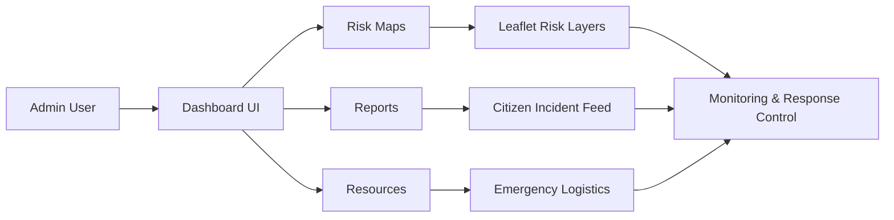

# EcoSentinel Admin

<p align="center">
  
  
  
  
</p>

EcoSentinel Admin is the command-center dashboard for environmental risk monitoring and disaster response coordination. It gives admins a clear operational view of real-time alerts, risk-prone areas, citizen reports, and emergency resources.

## Architecture overview



This app is built as a Vite + React + TypeScript dashboard. It uses a modular page structure for:

- dashboard analytics and trend monitoring,
- interactive map views for risk zones,
- citizen report review workflows,
- emergency resource planning and allocation.

## Features

### Dashboard analytics
- active alert summaries
- chart-based trend analysis
- risk distribution across regions
- actionable alert cards for response teams

### Risk maps
- map-based visualization of flood, cyclone, and landslide risk zones
- colored risk overlays and alert markers
- shelter and emergency location layers

### Reports and coordination
- citizen incident review
- verified vs pending report states
- response actions for critical issues

### Resource management
- emergency shelter tracking
- logistics and response readiness overview
- operational navigation for priority tasks

## Tech stack

- React 18
- TypeScript
- Vite
- Tailwind CSS
- Leaflet + react-leaflet
- Recharts
- Lucide React

## Project structure

```text
EcoSentineladmin/
├── index.html
├── package.json
├── vite.config.ts
├── tailwind.config.ts
├── tsconfig.json
├── src/
│   ├── App.tsx
│   ├── components/
│   ├── hooks/
│   ├── lib/
│   ├── pages/
│   ├── index.css
│   └── main.tsx
├── public/
├── .gitignore
└── package-lock.json
```

## Getting started

### 1. Install dependencies

```bash
npm install
```

### 2. Run locally

```bash
npm run dev
```

Then open:

```text
http://localhost:5173
```

### 3. Build for production

```bash
npm run build
```

### 4. Preview the production build

```bash
npm run preview
```

## Environment variables

This project does not currently define a `.env` file. If the app is connected to a backend later, common variables may include:

```bash
VITE_API_BASE_URL=
VITE_MAP_TILE_URL=
VITE_APP_NAME=EcoSentinel Admin
```

## Screenshots

No screenshots are included in the repo yet. Add them under a folder such as `docs/screenshots/` and reference them like this:

```md


```

## Related project

This admin dashboard is designed to work alongside the citizen-facing app:

- EcoSentinel User: https://github.com/Gokulakrishnan610/EcoSentineluser

## Purpose

EcoSentinel Admin helps emergency teams respond faster, coordinate field actions, and keep a clear view of environmental risks in vulnerable regions.

## License

This project is intended for internal, educational, or demo use unless the repository owner specifies otherwise.
